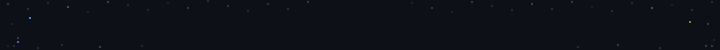

<!-- ═══════════════════════════════════════════════════ -->
<!-- BIO — placeholder, fill in later                   -->
<!-- ═══════════════════════════════════════════════════ -->

<!-- PLACEHOLDER: 2–3 sentence bio goes here -->

<!-- ═══════════════════════════════════════════════════ -->
<!-- ORBITAL SVG                                        -->
<!-- Data: placeholder — update manually or via Action  -->
<!-- ═══════════════════════════════════════════════════ -->

<!-- ═══════════════════════════════════════════════════ -->
<!-- TECH STACK                                         -->
<!-- ═══════════════════════════════════════════════════ -->

**💻 Languages**

**🛠️ Frameworks**

**🗄️ Databases**

**🚀 DevOps & Infra**

**🐧 Linux**

<!-- ═══════════════════════════════════════════════════ -->
<!-- FOOTER                                             -->
<!-- ═══════════════════════════════════════════════════ -->

<!-- PLACEHOLDER: Contact links row goes here -->

